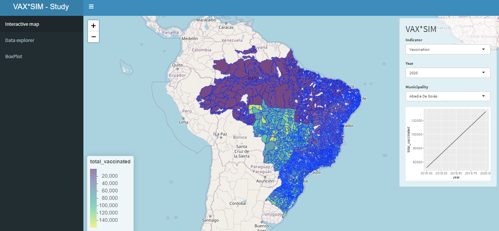

# Brazil muni stats



This application is deployed into EC2 AWS with shiny-server.

- http://ec2-54-94-50-220.sa-east-1.compute.amazonaws.com/
- http://nietocurcio.com/ (configured domain with AWS Elastic IP)

## Instructions on how to deploy with shiny-server and EC2

1. Create an EC2 Ubuntu instance and connect to the machine via SSH

2. Install R

```bash
$ sudo apt-get update
$ sudo apt-get install r-base
$ sudo apt-get install r-base-dev
```

3. Installing packages:

```bash
$ sudo su - \
-c "R -e \"install.packages('shiny', repos='https://cran.rstudio.com/')\""
```

4. Install shiny-server:

```bash
$ sudo apt-get install gdebi-core
$ wget https://download3.rstudio.org/ubuntu-18.04/x86_64/shiny-server-1.5.19.995-amd64.deb
$ sudo gdebi shiny-server-1.5.19.995-amd64.deb
```

5. Edit the Inbound rule in the firewall of the EC2 instance in the shiny-server port (default shiny-server port 3838).

6. [Optional] configure `shiny-server.conf` at `etc/shiny-server` (set to `preserve_logs true;` or set port to 80 with `listen 80;`)

- server logs are located at `var/log/shiny-server` by default.
- shiny apps are located at `srv/shiny-server`

Tips for installing packages:

Some packages can be easily installed as shown in step 3. But some of them it's difficult, s2 package for example caused me some issues (when installing `rmapshaper`). I could address the issues with s2 and other packages with `sudo apt-get install r-cran-s2` or `sudo apt-get install r-cran-tidyverse`. Unfortunately some packages are not available in PPA (https://stackoverflow.com/questions/63820701/installing-packages-takes-a-very-long-time-on-ubuntu). Some packages I've downloaded from cran and passed the `.tar.gz` file to install.packages. The packages must be installed in the "R -e \"install.packages('package-name', repos='https://cran.rstudio.com/')\"" environment in order to shiny-server be able to load the package, can be also used the devtools::install_github, but just install.packages should be fine.

Great tutorials and documentation:

- [sestelo guide](https://gist.github.com/sestelo/abdf9693cc3172078a519447fe51f899)
- [charlesbordet guide](https://www.charlesbordet.com/en/guide-shiny-aws/#1-how-to-access-the-default-shiny-app)
- [shiny-server docs](https://docs.rstudio.com/shiny-server)
- [Mayuran - set up domain for EC2](https://dev.to/maybebored/how-to-set-up-a-custom-domain-for-your-ec2-instance-without-using-route53-f9)
